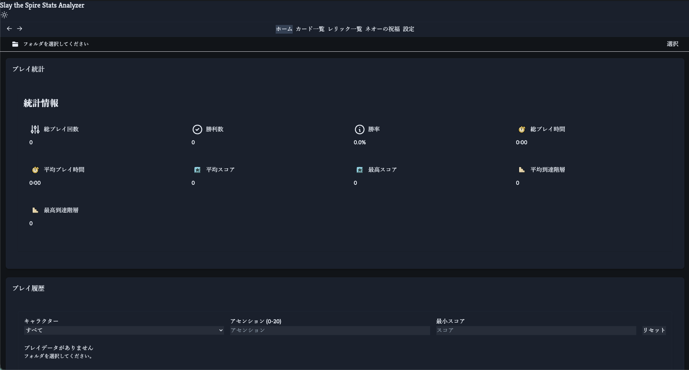

# StS Stats Analyzer

Slay the Spire のプレイデータを解析し、統計情報を可視化するデスクトップアプリケーションです。

<!-- スクリーンショットをここに配置してください -->
<!--  -->

## ダウンロード

[GitHub Releases](https://github.com/moritaniantech/slay-the-spire-stats-analyzer/releases/latest) から最新版をダウンロードできます。

| OS | ファイル |
|----|---------|
| Windows (x64) | `StS-Stats-Analyzer-Setup-X.X.X.exe` |
| macOS (Universal) | `StS-Stats-Analyzer-X.X.X-universal.dmg` |

## 使い方

1. アプリを起動します
2. Slay the Spire の `runs` フォルダを選択します
   - **Windows**: `C:\Program Files (x86)\Steam\steamapps\common\SlayTheSpire\runs`
   - **macOS**: `~/Library/Application Support/Steam/steamapps/common/SlayTheSpire/runs`
3. プレイデータが自動的に読み込まれ、統計情報が表示されます
4. 新しいランが追加されると自動的に検出・反映されます

## 機能

- 全キャラクターの統計概要（勝率、平均スコア、到達階数など）
- ラン一覧のフィルタリング・ソート
- 各ランの詳細表示（デッキ構築の推移、戦闘ログ）
- カード・レリックの使用統計
- Neow ボーナスの選択傾向
- 日本語 / 英語対応

## よくある質問

### Windows Defender の警告が表示される

コード署名なしの個人開発アプリのため、Windows SmartScreen が警告を表示する場合があります。
「詳細情報」→「実行」で起動できます。ウイルスではありません。

### macOS で「開発元が未確認」と表示される

コード署名・公証なしのため、初回起動時に警告が表示されます。
「システム設定」→「プライバシーとセキュリティ」→「このまま開く」で起動できます。

### データはどこに保存される？

アプリの設定とフォルダパスは以下に保存されます:
- **Windows**: `%APPDATA%/sts-stats-analyzer/`
- **macOS**: `~/Library/Application Support/sts-stats-analyzer/`

ゲームデータ自体は元の `runs` フォルダから読み取るだけで、変更しません。

<details>
<summary><h2>開発者向け情報</h2></summary>

### 技術スタック

- **フレームワーク**: Electron + React + TypeScript + Vite
- **UI**: TailwindCSS + DaisyUI + Framer Motion
- **状態管理**: Zustand + Redux Toolkit
- **グラフ**: Chart.js + react-chartjs-2
- **i18n**: i18next

### セットアップ

```bash
git clone https://github.com/moritaniantech/slay-the-spire-stats-analyzer.git
cd slay-the-spire-stats-analyzer
yarn install
yarn rebuild  # sqlite3 のリビルド
```

### コマンド

```bash
yarn electron:dev   # 開発モードで起動
yarn build:win      # Windows ビルド
yarn build:mac      # macOS ビルド
yarn build:all      # 全プラットフォームビルド
yarn lint           # リント
```

### ビルド出力

ビルドされたアプリは `release/` ディレクトリに出力されます。

</details>

## ライセンス

[MIT](LICENSE)

## 作者

[moritaniantech](https://github.com/moritaniantech)

## バグ報告・機能要望

[GitHub Issues](https://github.com/moritaniantech/slay-the-spire-stats-analyzer/issues) にお願いします。
